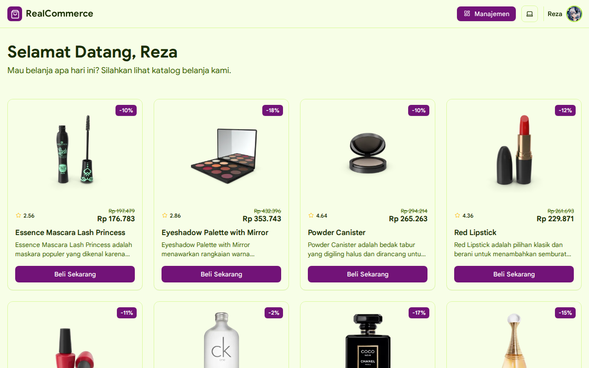
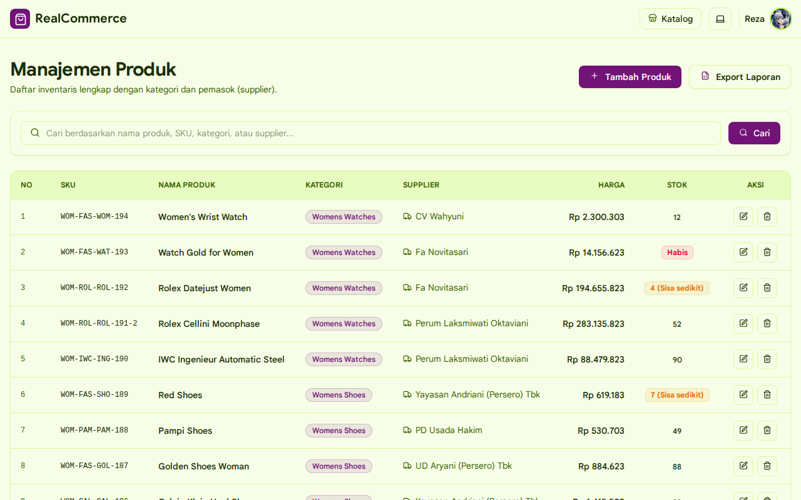
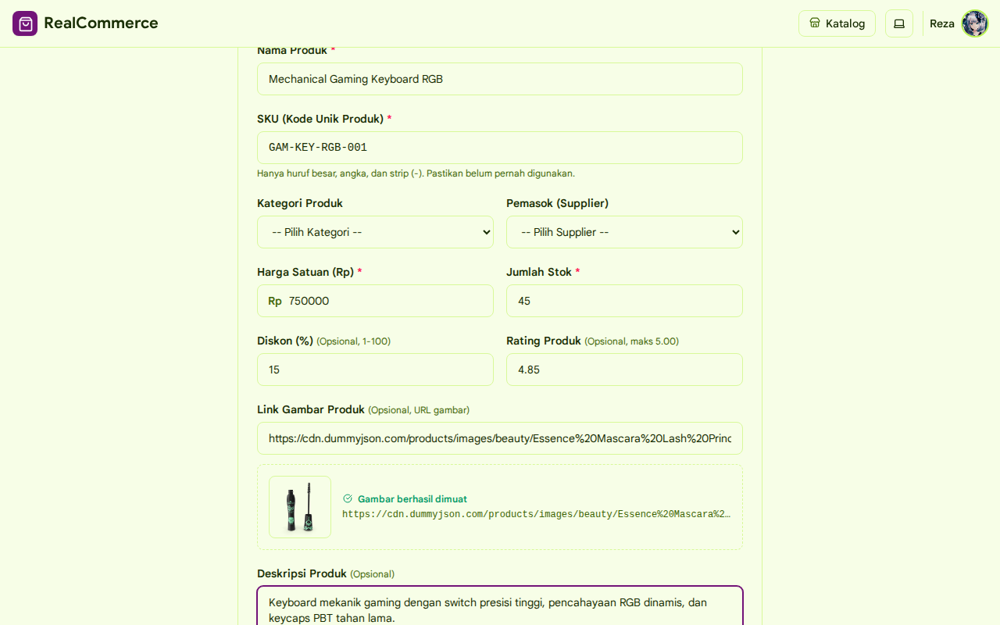
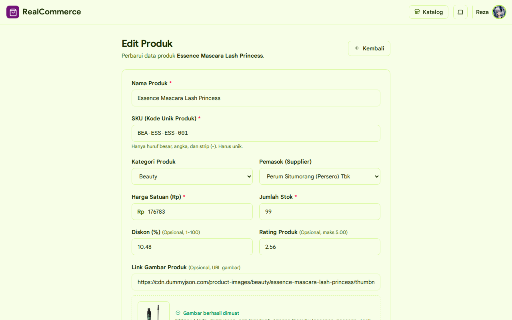
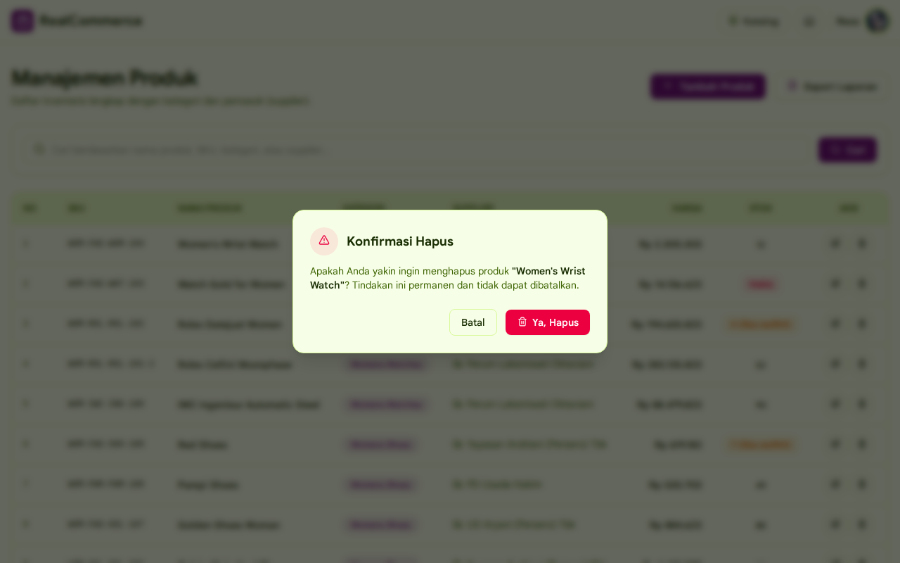
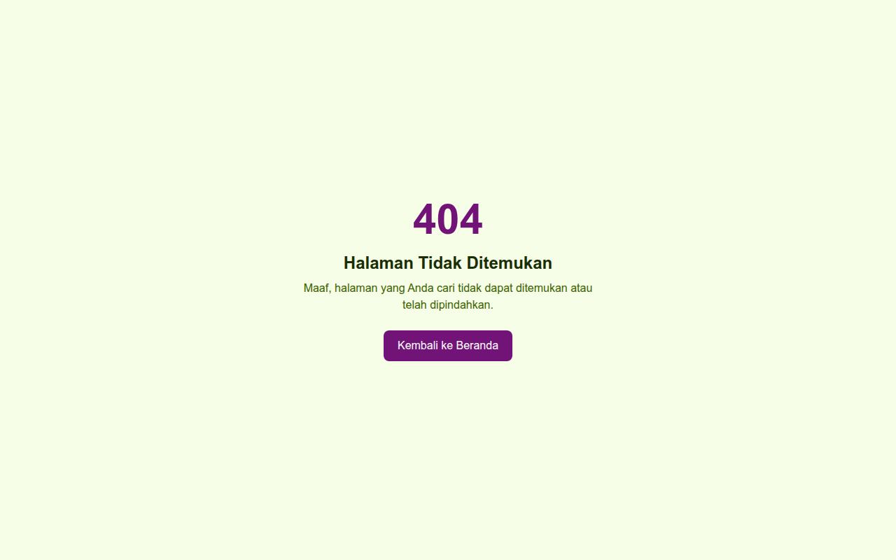

# RealCommerce — Tugas Pertemuan 8: Sistem CRUD & Manajemen Produk

**Automated Testing & Quality:**  

Aplikasi web sistem katalog belanja online dan manajemen inventaris produk (**CRUD**) modern berbasis **Plain PHP (MVC Pattern)** yang diintegrasikan dengan database **MySQL / MariaDB**, **Vite 8**, dan **Tailwind CSS v4**. Dibangun dengan pemisahan tanggung jawab yang rapi (*Model-View-Controller*, *Repository Pattern*, dan *Service Layer*), transaksi database ACID dengan pencatatan audit log (`storage/logs/database.log`), sistem migrasi & seeder mandiri (`composer db:migrate:fresh -- --seed`), validasi server-side yang ketat, ekspor laporan CSV asinkron (*Fetch API*), preview gambar produk reaktif, dan fitur reset database aman berbasis token kriptografi **UUID versi 7** (RFC 9562).

Website live: [inventaris.realitaa.dev](https://inventaris.realitaa.dev)  
Repository: [github.com/Realitaa/TugasWeb-Pertemuan8-CRUD](https://github.com/Realitaa/TugasWeb-Pertemuan8-CRUD)

---

## 📸 Tangkapan Layar Aplikasi (Desktop Mode)

Berikut dokumentasi tampilan visual aplikasi web pada resolusi desktop yang dihasilkan secara otomatis menggunakan pengujian Playwright E2E:

### 1. Halaman Utama / Katalog Belanja Publik (`/`)
Menampilkan katalog produk dari database MySQL dengan pagination interaktif, harga rupiah, rating bintang, badge diskon, serta tombol pemesanan langsung terintegrasi dengan WhatsApp.


### 2. Halaman Manajemen & Tabel Daftar Produk (`/products`)
Menampilkan daftar tabel inventaris lengkap dengan 2 JOIN relasi (Kategori & Supplier), status stok produk, pencarian multi-kolom, tombol ekspor laporan CSV asinkron, dan aksi edit/hapus.


### 3. Halaman Form Tambah Produk Baru (`/products/create`)
Formulir input data produk baru lengkap dengan kolom wajib dan opsional (diskon, rating, deskripsi), serta kartu **Preview Gambar Reaktif** yang memuat gambar secara langsung saat URL dimasukkan.


### 4. Halaman Form Edit Produk (`/products/edit`)
Formulir pembaruan data produk yang sudah terisi (*prefilled*) sesuai data di database, pengecekan keunikan SKU produk, dan pembaruan thumbnail secara real-time.


### 5. Modal Dialog Konfirmasi Hapus Produk
Modal dialog konfirmasi hapus berposisi di tengah layar secara horizontal dan vertikal dengan latar belakang redup (*backdrop blur*), memicu transaksi database dan logging saat disetujui.


### 6. Halaman 404 Not Found
Halaman penanganan rute tidak ditemukan yang informatif dan dilengkapi tombol kembali ke halaman beranda.


---

## 📋 Daftar Kebutuhan Tugas & Implementasi

Proyek ini telah mengimplementasikan seluruh kebutuhan tugas pertemuan 8 secara menyeluruh dan teruji:

### 1. Pola Arsitektur MVC & Pemisahan Tanggung Jawab
- **Model** (`app/Models/`): Representasi entitas data (`Product`, `Category`, `Supplier`) dengan metode `fromArray()` dan `toArray()`.
- **Repository** (`app/Repositories/`): Lapisan akses data SQL murni menggunakan PDO prepared statements (`ProductRepository`, `CategoryRepository`, `SupplierRepository`).
- **Service Layer** (`app/Services/`): Logika bisnis, aturan validasi, penulisan log transaksi, ekspor CSV, dan eksekusi reset database (`ProductService`, `DatabaseResetService`).
- **Controller** (`app/Controllers/`): Penanganan request HTTP, sanitasi input, dan delegasi ke view/redirect (`ProductController`, `DatabaseResetController`).
- **Views** (`resources/views/`): Antarmuka pengguna responsif berbasis template PHP murni yang terintegrasi dengan styling Tailwind CSS v4.

### 2. Relasi Database dengan 2 JOIN (Kategori & Supplier)
- Tabel `products` berelasi dengan tabel `categories` (`category_id` $\rightarrow$ `categories.id`) dan tabel `suppliers` (`supplier_id` $\rightarrow$ `suppliers.id`).
- Pada query tabel manajemen produk (`ProductRepository::paginate` dan `ProductRepository::allWithRelations`), dilakukan **2 JOIN sekaligus** (`LEFT JOIN categories` dan `LEFT JOIN suppliers`) untuk menyajikan informasi kategori produk dan nama distributor/supplier secara komprehensif.

### 3. Operasi CRUD Lengkap & Interaktif
- **Create**: Formulir penambahan produk baru dengan validasi data, dropdown kategori dan supplier dinamis, input diskon (1–100%), rating (0–5, 2 angka desimal), textarea deskripsi, dan URL gambar.
- **Read**: Menampilkan data produk pada katalog publik (`home.php`) serta tabel manajemen (`products/index.php`) lengkap dengan pagination dan filter pencarian.
- **Update**: Formulir edit dengan nilai yang telah terisi (*prefilled*), proteksi keunikan SKU (kecuali ID produk itu sendiri), serta pembaruan data yang cepat.
- **Delete**: Penghapusan data produk melalui tombol aksi ikonik dengan konfirmasi modal dialog.

### 4. Transaksi Database (ACID) & Audit Logging
- Penghapusan produk di-wrap di dalam transaksi database PDO (`beginTransaction()`, `commit()`, `rollBack()`).
- Setiap transaksi hapus yang berhasil di-commit akan secara atomik mencatat detail entri audit ke berkas [`storage/logs/database.log`](storage/logs/database.log) yang memuat timestamp, action `DELETE_PRODUCT`, ID, SKU, nama produk, harga, stok, kategori, dan supplier.
- Jika penulisan log gagal atau query database bermasalah, transaksi akan di-*rollback* otomatis sehingga integritas data tetap terjaga.

### 5. Ekspor Laporan CSV Asinkron (Fetch API)
- Disediakan tombol **Export Laporan** di samping tombol Tambah Produk pada halaman manajemen.
- Proses ekspor dieksekusi secara asinkron menggunakan **Fetch API** (tanpa SSR reload) agar pengguna tidak mengalami layar *freeze* atau *stuck*.
- Selama permintaan diproses, tombol otomatis di-*disable* dan menampilkan spinner ikon loading.
- File CSV dihasilkan secara andal dan cepat di server menggunakan library **League CSV** (`league/csv`) dan langsung diunduh oleh browser pengguna.

### 6. Kolom Produk Tambahan & Preview Gambar Reaktif
- **Deskripsi Produk**: Textarea opsional untuk spesifikasi dan keterangan detail produk.
- **Persentase Diskon**: Input opsional dengan validasi angka bernilai antara 1 sampai 100%.
- **Rating Produk**: Input opsional dengan batas nilai maksimal 5.00 dan format presisi 2 angka di belakang koma.
- **Link Gambar & Reactive Preview**: Input URL gambar opsional yang langsung memuat dan menampilkan kartu preview gambar secara otomatis di bawah input saat link diketik atau ditempel, lengkap dengan penanganan error fallback jika URL tidak valid.

### 7. Integrasi Katalog dari Database & Fallback Cerdas
- Katalog belanja pada `home.php` memuat produk langsung dari database MySQL (tidak lagi menggunakan data statis `products.json`).
- **Fallback Gambar Default**: Jika produk tidak memiliki thumbnail atau gambar gagal dimuat (`onerror`), otomatis digantikan oleh ikon default paket (`lucide:package`).
- **Fallback Rating**: Badge rating berbintang otomatis disembunyikan apabila rating tidak diisi.
- **Fallback Diskon**: Diskon dan harga coret hanya ditampilkan jika produk memiliki diskon aktif.

### 8. Sistem Reset Database Aman via Key Generator (UUID v7)
- **Node.js Command `key:generate`**:
  Perintah `pnpm run key:generate` mengeksekusi skrip [`scripts/generate-key.js`](scripts/generate-key.js) yang memanggil modul bawaan `node:crypto` untuk menghasilkan UUID versi 7 standar RFC 9562, kemudian secara otomatis menulis atau memperbarui kunci `DB_RESET_KEY` pada berkas `.env`.
- **Endpoint Reset Terproteksi**:
  Endpoint `POST /api/db/reset` (atau `/db/reset`) menerima parameter `key`.
  - Jika `key` tidak valid atau tidak cocok: Server langsung mengembalikan respons status **`403 Forbidden`** tanpa menampilkan informasi tambahan apapun.
  - Jika `key` valid: Server secara otomatis mengeksekusi migrasi fresh dan menjalankan seeder database, mengembalikan respons status `200 OK`.

### 9. Sanitasi XSS Global Menggunakan Fungsi `e()`
- Seluruh output dinamis disanitasi menggunakan fungsi global `e()` yang didefinisikan pada [`app/Vite/helpers.php`](app/Vite/helpers.php) untuk mencegah kerentanan Cross-Site Scripting (XSS).
- Teruji secara menyeluruh melalui unit test PHPUnit [`tests/HelpersTest.php`](tests/HelpersTest.php).

---

## 🛠️ Teknologi yang Digunakan

### Backend & Core
- **PHP 8.2+ / 8.5** — Native PHP dengan struktur MVC berorientasi objek, PSR-4 Autoloading, dan strict typing (`declare(strict_types=1)`).
- **Composer** — Manajemen dependensi PHP dan testing framework.
- **PDO & MySQL / MariaDB** — Database relasional dengan prepared statements dan transaksi ACID.
- **League CSV (`league/csv`)** — Library profesional pembuatan dan pemrosesan stream file CSV.
- **Faker (`fakerphp/faker`)** — Generator data acak realistis lokal Indonesia (`id_ID`) untuk seeding suppliers.
- **vlucas/phpdotenv** — Pengelolaan konfigurasi environment `.env`.
- **spatie/fork** — Eksekusi proses concurrent server PHP dan dev bundler Vite secara simultan.

### Frontend
- **Tailwind CSS v4** — Utility-first styling engine modern berbasis `@theme` token tanpa dependensi CSS kuno.
- **Vite 8** — Next-generation frontend tooling dengan Fast HMR dan asset manifest pipeline.
- **Iconify (`iconify-icon`)** — Ikon vektor ringan dan performan tinggi.
- **Toastify.js** — Notifikasi toast interaktif.

### Quality Assurance & Testing
- **PHPUnit 11** — Pengujian otomatis unit dan integrasi (35 tests, 82 assertions).
- **Playwright** — End-to-End (E2E) automated browser testing dan visual regression/screenshot generator pada mode desktop.

---

## 🧪 Pengujian Otomatis (Automated Testing)

Proyek ini dilengkapi dua tingkat pengujian otomatis untuk menjamin keandalan sistem:

### 1. Menjalankan Unit Testing PHPUnit

Jalankan pengujian unit melalui Composer:

```bash
composer test
# atau melalui binary PHPUnit langsung:
./vendor/bin/phpunit --colors=always
```

Ringkasan hasil pengujian:
```text
PHPUnit 11.5.56 by Sebastian Bergmann and contributors.

Runtime:       PHP 8.5.0
Configuration: /path/to/phpunit.xml

...................................                               35 / 35 (100%)

Time: 00:00.069, Memory: 10.00 MB

OK (35 tests, 82 assertions)
```

Suite pengujian mencakup:
- [`tests/HelpersTest.php`](tests/HelpersTest.php): Pengujian fungsi sanitasi HTML `e()` dan helper formatting rupiah `format_rupiah()`.
- [`tests/ProductModelTest.php`](tests/ProductModelTest.php): Pengujian instansiasi model `Product`, parsing array, dan serialisasi data.
- [`tests/DatabaseResetServiceTest.php`](tests/DatabaseResetServiceTest.php): Pengujian validasi kunci rahasia `DB_RESET_KEY` (timing-safe check) dan penanganan input tidak sah.
- [`tests/ViteTest.php`](tests/ViteTest.php): Pengujian Vite tag generator, asset manifest resolver, dan dev mode detection.

### 2. Menjalankan E2E Testing & Screenshot Generator (Playwright)

Jalankan pengujian E2E browser untuk memverifikasi fungsionalitas dan memperbarui file tangkapan layar di `tests/screenshots/`:

```bash
pnpm run test:e2e
```

Hasil pengujian otomatis tersimpan di direktori `tests/screenshots/`:
- `01-katalog-home.png`
- `02-manajemen-produk.png`
- `03-tambah-produk.png`
- `04-edit-produk.png`
- `05-modal-konfirmasi-hapus.png`
- `06-halaman-404.png`

---

## 🚀 Panduan Menjalankan Proyek Secara Lokal

### 1. Prasyarat Sistem
- **PHP** 8.2 atau lebih baru (dengan ekstensi `pdo_mysql`, `mbstring`, `curl`)
- **MySQL** atau **MariaDB** server aktif
- **Composer** 2.x
- **Node.js** 20 atau lebih baru
- **pnpm** (atau npm)

### 2. Instalasi Dependensi
Clone repository dan pasang seluruh paket dependensi:

```bash
git clone https://github.com/Realitaa/TugasWeb-Pertemuan8-CRUD.git
cd TugasWeb-Pertemuan8-CRUD

# Install dependensi frontend & backend
pnpm install
composer install
```

### 3. Konfigurasi Environment & Key Generation
Salin template konfigurasi `.env`:

```bash
cp .env.example .env
```

Sesuaikan kredensial koneksi database pada `.env` (`DB_DATABASE`, `DB_USERNAME`, `DB_PASSWORD`).  
Kemudian buat kunci reset database baru:

```bash
pnpm run key:generate
```

### 4. Migrasi Database & Seeding
Jalankan migrasi tabel dan pengisian data contoh:

```bash
# Menjalankan migrasi fresh beserta seeder
composer db:migrate:fresh -- --seed
```

### 5. Menjalankan Server Pengembangan (Dev Mode)
Jalankan dev server concurrent (menjalankan server PHP dan Vite sekaligus):

```bash
composer dev
```

Buka peramban Anda pada tautan: **`http://localhost:8000`**

### 6. Build Produksi (Production Build)
Untuk melakukan kompilasi aset statis siap rilis ke folder `dist/`:

```bash
pnpm run build
```

---

## 📁 Struktur Direktori Proyek

```text
├── app/
│   ├── Controllers/
│   │   ├── DatabaseResetController.php   # Handler endpoint reset database (POST)
│   │   └── ProductController.php         # Handler halaman katalog, tabel, form, & CRUD
│   ├── Models/
│   │   ├── Category.php                  # Model entitas Kategori
│   │   ├── Product.php                   # Model entitas Produk
│   │   └── Supplier.php                  # Model entitas Pemasok/Supplier
│   ├── Repositories/
│   │   ├── CategoryRepository.php        # Query database tabel categories
│   │   ├── ProductRepository.php         # Query CRUD produk, pagination, & 2 JOINs
│   │   └── SupplierRepository.php        # Query database tabel suppliers
│   ├── Services/
│   │   ├── DatabaseResetService.php      # Layanan validasi key & migrasi fresh + seed
│   │   └── ProductService.php            # Validasi input, log transaksi, & ekspor CSV
│   └── Vite/
│       ├── Vite.php                      # Adapter tag injector Vite
│       └── helpers.php                   # Fungsi global e(), format_rupiah(), view(), dll.
├── bin/
│   ├── dev.php                           # Skrip concurrent runner PHP & Vite
│   ├── fresh.php                         # CLI runner composer db:migrate:fresh
│   ├── migrate.php                       # CLI runner composer db:migrate
│   └── seed.php                          # CLI runner composer db:seed
├── config/
│   └── database.php                      # Konfigurasi koneksi database MySQL/SQLite
├── database/
│   ├── migrations/
│   │   └── schema.sql                    # Skema DDL tabel categories, suppliers, products
│   ├── pdo.php                           # Singleton inisialisasi koneksi PDO
│   └── Seeder/
│       └── Seeder.php                    # Seeder otomatis kategori, supplier, & produk
├── resources/
│   ├── css/
│   │   └── app.css                       # Styling Tailwind CSS v4 & custom theme
│   ├── js/
│   │   ├── app.js                        # Entrypoint JS aplikasi
│   │   ├── pagination.js                 # Helper komponen pagination
│   │   ├── products.js                   # Client-side renderer katalog belanja
│   │   └── utils.js                      # Helper formatting rupiah & status waktu
│   └── views/
│       ├── layouts/
│       │   └── app.php                   # Main layout HTML, meta tags, & navbar
│       ├── products/
│       │   ├── create.php                # View formulir tambah produk & live preview
│       │   ├── edit.php                  # View formulir edit produk
│       │   └── index.php                 # View tabel daftar produk & modal konfirmasi
│       ├── 404.php                       # View halaman 404 Not Found
│       └── home.php                      # View katalog belanja utama
├── scripts/
│   ├── fetch-products.js                 # Skrip penarik data dari DummyJSON
│   └── generate-key.js                   # Generator UUID v7 & pengisi DB_RESET_KEY .env
├── storage/
│   └── logs/
│       └── database.log                  # Log transaksi database (ACID audit trail)
├── tests/
│   ├── e2e/
│   │   └── screenshots.spec.js           # Playwright E2E & Desktop Screenshot test
│   ├── screenshots/                      # Direktori penyimpanan tangkapan layar desktop
│   │   ├── 01-katalog-home.png
│   │   ├── 02-manajemen-produk.png
│   │   ├── 03-tambah-produk.png
│   │   ├── 04-edit-produk.png
│   │   ├── 05-modal-konfirmasi-hapus.png
│   │   └── 06-halaman-404.png
│   ├── DatabaseResetServiceTest.php      # Unit test validasi key reset database
│   ├── HelpersTest.php                   # Unit test fungsi e() & format_rupiah()
│   ├── ProductModelTest.php              # Unit test model Product
│   └── ViteTest.php                      # Unit test Vite adapter
├── index.php                             # Router utama aplikasi web
├── playwright.config.js                  # Konfigurasi Playwright E2E Desktop
├── composer.json                         # Dependensi PHP & composer scripts
├── package.json                          # Dependensi frontend & node scripts
└── vite.config.js                        # Konfigurasi bundler Vite 8
```

---

## 📄 Lisensi

Proyek ini dilisensikan di bawah [MIT License](LICENSE).
