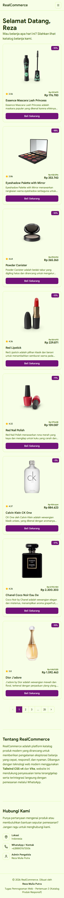
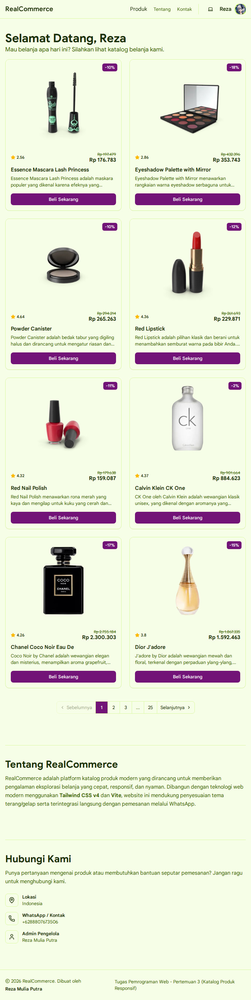
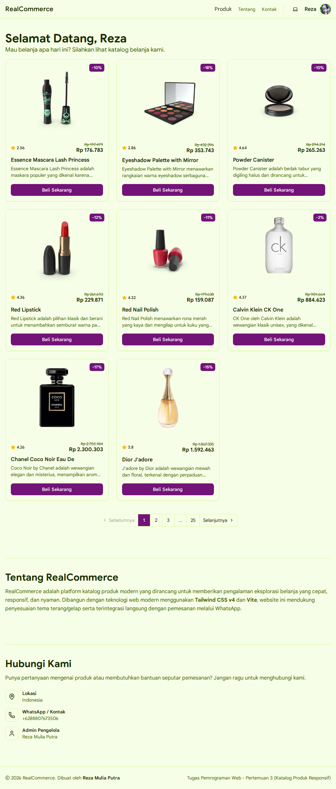
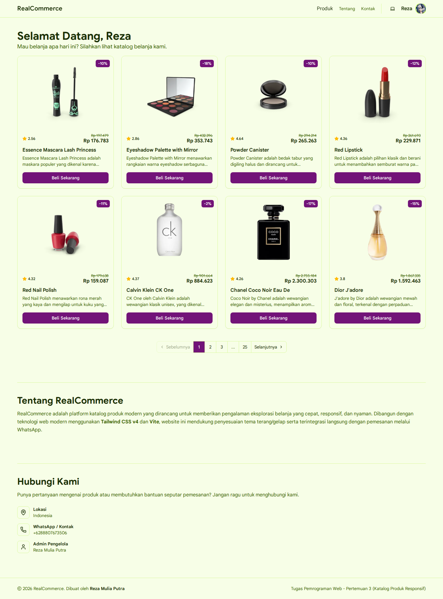

# RealCommerce - Katalog Produk Responsif

**Automated Checks:** 

> 🎓 **Tugas Kuliah**: Proyek pembuatan web Katalog Produk Responsif berbasis **Tailwind CSS v4**. 

Website live: [realcommerce.realitaa.dev](https://realcommerce.realitaa.dev)

---

## 📌 Deskripsi Proyek

**RealCommerce** adalah aplikasi web katalog belanja satu halaman (*single-page catalog*) yang menampilkan produk responsif dengan fitur:
- 📱 **Navigasi Responsif**: Hamburger menu mobile-friendly tanpa ketergantungan JavaScript library berat.
- 🌓 **Tema Fleksibel**: Mendukung preferensi mode **Light**, **Dark**, dan **System** dengan persistensi `localStorage`.
- 🎨 **Tailwind CSS v4**: Menggunakan token `@theme` semantik tanpa arbitrary class usang.
- 📄 **Pagination Otomatis**: Menampilkan produk per halaman dengan navigasi halaman interaktif.
- 💱 **Mata Uang Rupiah (IDR)**: Harga produk dikonversi otomatis dari USD ke IDR.
- 🌐 **Deskripsi Terjemahan**: Deskripsi produk diterjemahkan ke Bahasa Indonesia dengan tetap mempertahankan nama/merk produk asli.

---

## 📦 Sumber Data & Pipeline Preprocessing

Data produk yang digunakan pada website ini bukan hardcoded secara manual, melainkan melalui pipeline otomatis:

1. **Sumber Data**:
   - Produk diambil dari API publik [DummyJSON Products](https://dummyjson.com/products).
   - Kurs mata uang terkini diambil dari [Frankfurter API](https://api.frankfurter.dev/v2/rate/USD/IDR).
2. **Translasi**:
   - Menerjemahkan deskripsi produk ke Bahasa Indonesia menggunakan `@vitalets/google-translate-api` secara batch untuk menghindari rate limit.
   - Nama produk (*title*) dan kemunculannya di dalam deskripsi tetap dipertahankan (*masked*) agar tidak salah diterjemahkan.
3. **Konversi Harga**:
   - Menghitung harga IDR berdasarkan kurs live Frankfurter dan membulatkannya ke format Rupiah.

---

## 🚀 Panduan Memulai (Quick Start)

### 1. Instalasi Dependensi
Pastikan [Node.js](https://nodejs.org/) dan [pnpm](https://pnpm.io/) telah terpasang di komputer Anda.
```bash
# Clone repository
git clone https://github.com/Realitaa/TugasWeb-Pertemuan3-Katalog.git
cd TugasWeb-Pertemuan3-Katalog

# Install seluruh dependensi
pnpm install
```

### 2. Menjalankan Mode Development
```bash
pnpm run dev
```
Buka browser pada alamat `http://localhost:5173`.

### 3. Daftar Perintah Script Lengkap

| Perintah | Deskripsi |
|---|---|
| `pnpm run dev` | Menjalankan server development lokal Vite |
| `pnpm run fetch:data` | Mengambil seluruh data mentah dari DummyJSON ke `data/products-raw.json` |
| `pnpm run process:data` | Menjalankan translasi deskripsi & konversi kurs USD $\rightarrow$ IDR |
| `pnpm run pipeline` | Menjalankan proses fetch dan processing data secara berurutan |
| `pnpm run build` | Melakukan build aplikasi ke folder `dist/` *(Menggunakan `data/products.json`)* |
| `pnpm run build:full` | **Perintah All-in-One**: Menjalankan fetch data + processing + build Vite |
| `pnpm run test` | Menjalankan Unit Testing struktur DOM & utility Tailwind (Vitest) |
| `pnpm run test:e2e` | Menjalankan E2E testing & screenshot multi-breakpoint (Playwright) |
| `pnpm run test:all` | Menjalankan seluruh pengujian (Unit Test + E2E Test) |

---

## 🧪 Panduan Menjalankan Pengujian (Testing)

Proyek ini dilengkapi dengan 2 jenis pengujian otomatis:

### 1. Menjalankan Unit Testing (Vitest + Happy DOM)
Digunakan untuk memvalidasi struktur semantic HTML dan kelas responsif Tailwind CSS:
```bash
pnpm run test
```

### 2. Menjalankan E2E & Screenshot Testing (Playwright)
Digunakan untuk menjalankan browser headless dan mengambil screenshot di seluruh breakpoint layar:
```bash
# Install browser Playwright (hanya sekali jika belum terpasang)
pnpm exec playwright install chromium

# Jalankan pengujian E2E & generate screenshot
pnpm run test:e2e
```
*Screenshot hasil pengujian akan otomatis tersimpan di folder `tests/screenshots/`.*

---

## 📊 Hasil Pengujian & Dokumentasi Screenshot Responsif

### 1. Hasil Unit Testing (Vitest)
* **Status**: `5/5 Tests Passed (100%)`
* **Cakupan Pengujian**:
  - ✅ Grid produk responsif mobile-first (`grid-cols-1` $\rightarrow$ `sm:grid-cols-2` $\rightarrow$ `lg:grid-cols-3` $\rightarrow$ `xl:grid-cols-4`).
  - ✅ Navbar responsif (hamburger collapse di mobile `<640px`, flex row di desktop `≥640px`).
  - ✅ Responsive images (`w-full h-full object-contain` dengan aspect-ratio container).
  - ✅ Komponen kartu produk lengkap (gambar + rating + harga + diskon + tombol beli WhatsApp).
  - ✅ Footer semantik responsif.

### 2. Hasil Screenshot di Seluruh Breakpoint

| Breakpoint | Resolusi Viewport | Karakteristik Tampilan | Screenshot Pengujian |
|---|---|---|:---:|
| **Mobile** | `<640px` (375 × 667) | 1 Kolom Grid, Hamburger Menu aktif |  |
| **Tablet (`sm`)** | `≥640px` (768 × 1024) | 2 Kolom Grid, Navigasi Desktop terlihat |  |
| **Desktop (`lg`)** | `≥1024px` (1024 × 768) | 3 Kolom Grid, Full Layout |  |
| **Desktop Wide (`xl`)** | `≥1280px` (1440 × 900) | 4 Kolom Grid, Container 85rem Max-Width |  |

---

## ✅ Kesimpulan Pemenuhan Tugas

Berdasarkan lembar panduan **Tugas Rutin 3: Katalog Produk Responsif**:

| No | Kriteria Utama Tugas | Status | Keterangan Implementasi |
|:---:|---|:---:|---|
| 1 | **Mobile-first approach** | **TERPENUHI** | Kelas dasar untuk mobile (`grid-cols-1`, menu collapse), modifier breakpoint `sm:`, `lg:`, `xl:` untuk layar lebih besar. |
| 2 | **Minimal 3 breakpoint** | **TERPENUHI** | Menggunakan 4 breakpoint: Mobile (`<640px`), `sm` (`≥640px`), `lg` (`≥1024px`), dan `xl` (`≥1280px`). |
| 3 | **Grid responsif (1 $\rightarrow$ 2 $\rightarrow$ 3/4 kolom)** | **TERPENUHI** | Menggunakan class Tailwind `grid grid-cols-1 sm:grid-cols-2 lg:grid-cols-3 xl:grid-cols-4`. |
| 4 | **Card produk (gambar + info + harga + btn)** | **TERPENUHI** | Kartu memuat thumbnail responsif, badge diskon, rating bintang Lucide, judul, deskripsi terjemahan, harga rupiah, dan tombol pesan via WhatsApp. |
| 5 | **Navbar responsif (hamburger di mobile)** | **TERPENUHI** | Menggunakan tombol toggle hamburger di mobile (`sm:hidden`) dan collapse menu (`sm:flex`). Dilengkapi sticky header dan smooth-scrolling section. |
| 6 | **Responsive images** | **TERPENUHI** | Container aspect ratio `pt-[75%]` dengan gambar `w-full h-full object-contain` dan lazy loading. |
| 7 | **clamp() untuk typography** | *Dikecualikan* | Sesuai instruksi pengguna. |
| 8 | **Footer** | **TERPENUHI** | Terdapat `<footer>` semantik responsif (`flex-col sm:flex-row`) dengan identitas pembuat. |
| 9 | **Dokumentasi testing (screenshot breakpoint)** | **TERPENUHI** | Disediakan screenshot lengkap 4 breakpoint yang dihasilkan via Playwright E2E testing di folder `tests/screenshots/`. |

**Kesimpulan Akhir:** Seluruh kriteria Tugas Rutin 3 telah **100% terpenuhi dan terverifikasi secara otomatis**.
